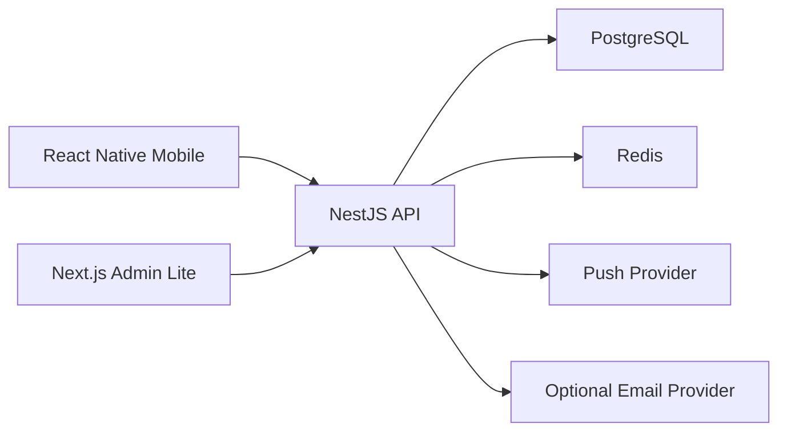

# Architecture Overview

## System Shape

V1 uses three applications and shared libraries inside an Nx monorepo:

- React Native mobile app for public, candidate, and brother modes;
- Next.js App Router Admin Lite web panel;
- NestJS backend API;
- PostgreSQL as source of truth;
- Redis for real-time silent prayer presence and background coordination;
- push notification provider for authenticated users.
- generated OpenAPI/TypeScript contracts shared by mobile, admin, and API.
- explicit runtime modes so mobile/admin can run against the API or against local demo fixtures.

## Architectural Rules

- Public endpoints must be physically separate or strongly filtered.
- Visibility filtering is enforced server-side, never only in clients.
- Officer scope is resolved in backend guards/services.
- Publishable content uses common status, visibility, approval, and audit metadata.
- Critical changes create audit logs.
- Silent prayer stores aggregate/presence data only and avoids spiritual surveillance.
- Shared validation schemas define request/response contracts; clients do not hand-roll API shapes.
- Provider integrations for push, email, storage, logging, and metrics live behind adapters.
- Database migrations and seed changes travel with the feature that requires them.
- Demo mode must not bypass production authorization or leak into production builds.

## V1 Boundaries

Admin Lite manages only V1 entities. Do not add full ERP modules, payments, chat, maps, analytics suite, or extended Order hierarchy.
