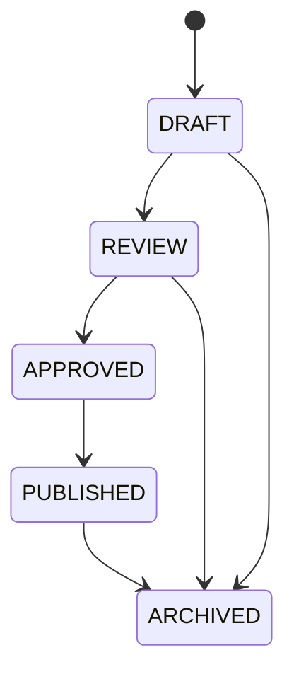

# Content Publishing Model

## Status Lifecycle

## Shared Fields

Publishable content should include:

- `status`;
- `visibility`;
- `target_organization_unit_id` where applicable;
- `language`;
- `created_by`;
- `updated_by`;
- `approved_by`;
- `approved_at`;
- `published_by`;
- `published_at`;
- `archived_at`.

## Business Rules

- Only approved `PUBLISHED` content appears in mobile/public/member read APIs
  for approval-required surfaces. Published rows without approval metadata are
  treated as hidden on user-facing reads.
- Admin updates must not leave a published approval-required record without
  approval metadata. Prayer, announcement, event, and silent-prayer updates
  that would keep a record published without explicit approval metadata are
  rejected before persistence, push dispatch, and audit side effects.
- `APPROVED` may be required before publish depending on configuration.
- Changing visibility is a critical action and should be audited.
- Archived content remains in the database but is excluded from normal lists.
- Prayer and official explanatory content require pastoral/content approval before production publication.

## V1 Approval Process

V1 uses a deliberately small approval workflow:

1. Admin Lite writers create or edit content as `DRAFT` or move it to `REVIEW`.
2. A content approver records approval by moving the row to `APPROVED`, which
   stamps approval metadata where the backing table supports it.
3. A publisher moves approved content to `PUBLISHED`; backend guards reject
   direct publish attempts unless approval evidence already exists.
4. Admin Lite renders approval and publication actor/timestamp evidence for
   operators and flags legacy published rows that lack approval metadata.
5. If a legacy row is published without approval evidence, normal publish/cancel
   lifecycle actions are suppressed; operators archive it or correct approval
   evidence through an owner-approved operational path.

This process covers V1 prayer, event, announcement, silent-prayer, and public
content-page surfaces. More complex editorial assignment, approval comments,
bulk approval, or multi-approver workflows remain out of V1 scope unless the
owner explicitly approves an expansion.
