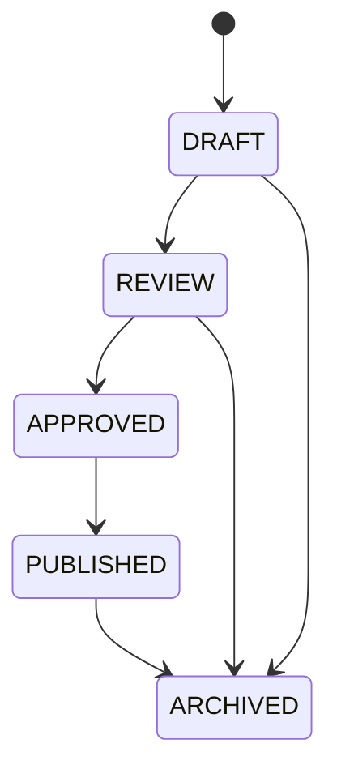

# Content Publishing Model

## Status Lifecycle

## Shared Fields

Publishable content should include:

- `status`;
- `visibility`;
- `target_choragiew_id` where applicable;
- `language`;
- `created_by`;
- `updated_by`;
- `approved_by`;
- `published_by`;
- `published_at`;
- `archived_at`.

## Business Rules

- Only `PUBLISHED` content appears in mobile/public read APIs.
- `APPROVED` may be required before publish depending on configuration.
- Changing visibility is a critical action and should be audited.
- Archived content remains in the database but is excluded from normal lists.
- Prayer and official explanatory content require pastoral/content approval before production publication.

