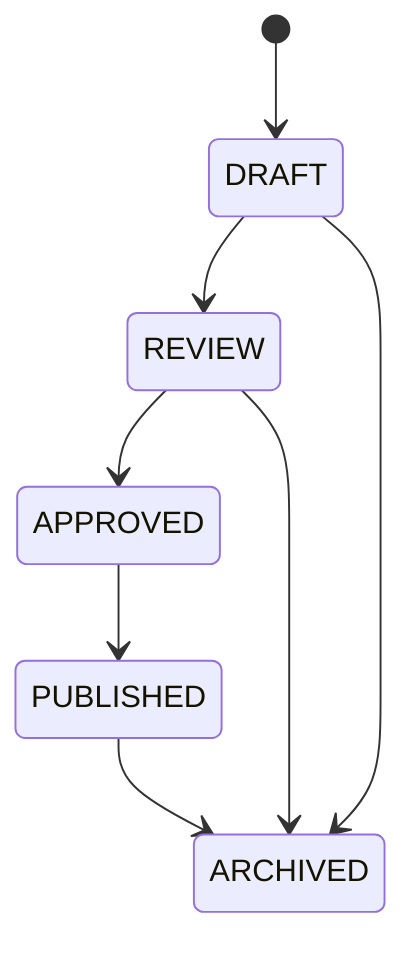

# Content Publishing Model

## Status Lifecycle

## Shared Fields

Publishable content should include:

- `status`;
- `visibility`;
- `target_organization_unit_id` where applicable;
- `language`;
- `created_by`;
- `updated_by`;
- `approved_by`;
- `approved_at`;
- `published_by`;
- `published_at`;
- `archived_at`.

## Business Rules

- Only approved `PUBLISHED` content appears in mobile/public/member read APIs
  for approval-required surfaces. Published rows without approval metadata are
  treated as hidden on user-facing reads.
- Admin updates must not leave a published approval-required record without
  approval metadata. Event and silent-prayer updates that explicitly clear
  approval while the record remains published are rejected before persistence
  and audit side effects.
- `APPROVED` may be required before publish depending on configuration.
- Changing visibility is a critical action and should be audited.
- Archived content remains in the database but is excluded from normal lists.
- Prayer and official explanatory content require pastoral/content approval before production publication.
