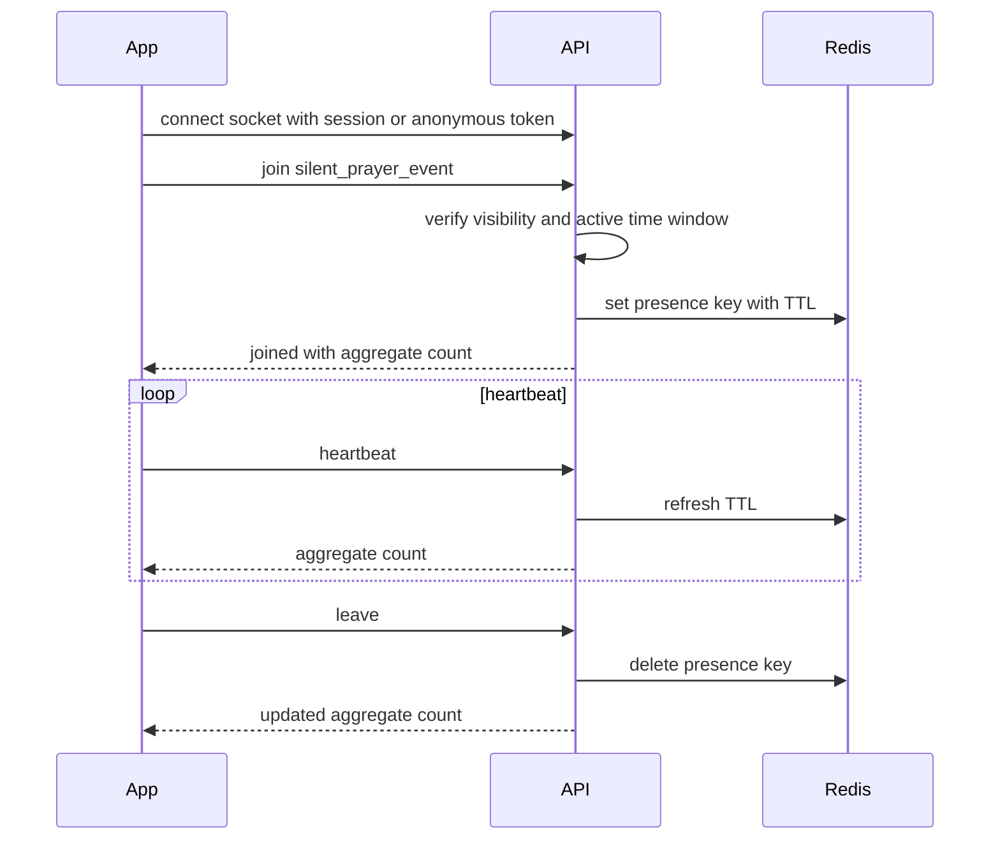

# Real-Time Silent Prayer

## Purpose

Silent prayer lets public guests or authenticated brothers pray together without chat, audio, video, ranking, or public participant lists.

## Room Model

| Session type | Identity | Counter | Storage |
| --- | --- | --- | --- |
| Public | Anonymous connection/session id | Aggregate active count | Redis TTL; optional aggregate DB summary |
| Candidate/Brother | Authenticated user id | One active presence per user per event | Redis TTL; optional aggregate DB summary |

## Sequence

## Rules

- Duplicate joins from the same authenticated user count once.
- Public anonymous users are not linked to person records.
- Participant lists are not exposed in V1.
- Disconnected clients expire by TTL.
- Redis is required for multi-instance correctness.

