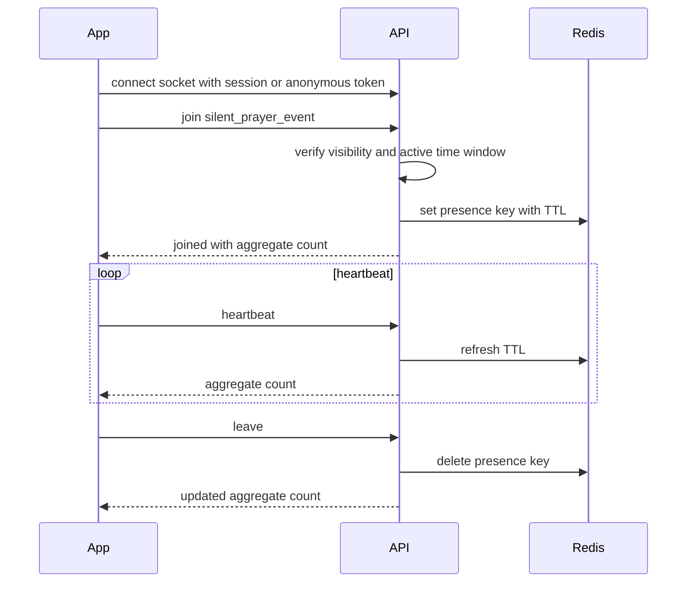

# Real-Time Silent Prayer

## Purpose

Silent prayer lets public guests or authenticated brothers pray together without chat, audio, video, ranking, or public participant lists.

## Room Model

| Session type | Identity | Counter | Storage |
| --- | --- | --- | --- |
| Public | Anonymous connection/session id | Aggregate active count | Implemented Redis TTL/Socket.IO path; mobile RTDB aggregate-count listener and rules baseline added for pilot migration |
| Candidate/Brother | Authenticated user id | One active presence per user per event | Implemented Redis TTL/Socket.IO path; mobile RTDB private aggregate listener and rules baseline added for pilot migration |

## Sequence

## Implemented Transport

- Socket.IO namespace: `/silent-prayer`
- Join events: `silent-prayer:public:join` and `silent-prayer:brother:join`
- Session events: `silent-prayer:heartbeat`, `silent-prayer:leave`, `silent-prayer:presence`, `silent-prayer:joined`, and `silent-prayer:error`
- Brother socket auth uses the existing bearer/cookie session resolution path.
- `REDIS_URL` enables the Redis presence store and Socket.IO Redis adapter. Production startup fails if Redis is not configured; local/test environments use the deterministic in-memory store.

## Low-Cost RTDB Transport

The pilot-cost migration is documented in
[docs/deployment/realtime-db-silent-prayer-migration-plan.md](../deployment/realtime-db-silent-prayer-migration-plan.md).
The target is to remove the Memorystore idle-cost requirement for pilot by using
Firebase Realtime Database for aggregate count updates.

Non-negotiable architecture constraints:

- PostgreSQL remains the source of truth for event metadata and visibility.
- The Nest API remains the authorization boundary for public/family-open event
  visibility, active time windows, brother membership, and organization-unit
  scope.
- Firebase RTDB Security Rules protect narrow read/write paths, but they do not
  replace API domain authorization.
- Mobile clients may subscribe only to aggregate count paths.
- Mobile clients must not read or write presence records, participant keys,
  private read grants, rosters, anonymous session ids, local user ids, Firebase
  uids, emails, intention text, or prayer history.
- Private brother/scoped counts require API-issued per-user/event read grants.
- Provider selection must live behind adapters so services and screens do not
  branch directly on Redis versus RTDB.

Implemented pilot-migration slices:

- API-owned public/brother REST heartbeat and leave contracts for RTDB-managed
  presence refresh and exit.
- Mobile `SilentPrayerRealtime` provider-neutral port that keeps the current
  Socket.IO provider as default compatibility and can switch to Firebase RTDB
  aggregate-count listeners through `EXPO_PUBLIC_SILENT_PRAYER_REALTIME_PROVIDER=firebase-rtdb`.
- Mobile REST heartbeat/leave helpers used by the RTDB listener path.
- API Firebase Admin RTDB provider/publisher behind the silent-prayer presence
  store and realtime publisher ports. The API writes hashed presence keys,
  public/private aggregate count paths, and private read grants only after the
  existing REST/socket service authorization checks have succeeded.
- Deny-by-default RTDB rules baseline in
  [`infra/firebase/database.rules.json`](../../infra/firebase/database.rules.json).

Remaining validation slice:

- Firebase emulator/rules tests now verify public aggregate reads, private
  aggregate reads through unexpired API-issued Firebase UID grants, denial for
  expired/ungranted private reads, and denied client writes to count, presence,
  and grant paths.
- `pnpm validate:mobile-rtdb-native -- --platform ios|android` now preflights
  native Expo RTDB configuration before a device run by checking API mode,
  `firebase-rtdb` mobile provider selection, Firebase client RTDB values, a
  device-reachable HTTPS API URL, and native Google/Firebase OAuth values.
- Verify aggregate public/brother count behavior on a native device with pilot
  Firebase configuration.

Redis/Socket.IO should remain available as a fallback provider until pilot RTDB
behavior is proven on a real device.

## Rules

- Duplicate joins from the same authenticated user count once.
- Public anonymous users are not linked to person records.
- Participant lists are not exposed in V1.
- Disconnected clients expire by TTL.
- Redis remains available for the current Socket.IO compatibility provider. The
  RTDB provider replaces the live pilot Redis/Memorystore requirement only after
  Firebase rules tests, native-device validation, and launch smoke checks pass.
