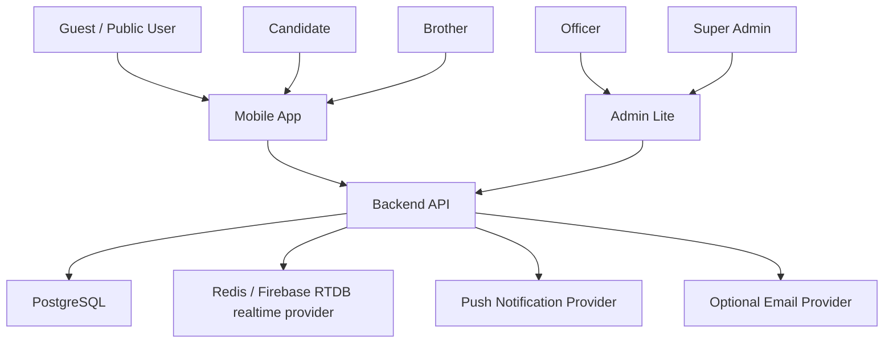

# System Context

## Components

| Component | Responsibility |
| --- | --- |
| Mobile App | Public discovery, candidate mode, brother companion |
| Admin Lite | Scoped officer/super admin operations |
| Backend API | Authentication, authorization, domain logic, visibility filtering |
| PostgreSQL | Durable V1 data |
| Realtime provider | Implemented Redis path for silent-prayer presence and transient counters; planned Firebase RTDB aggregate-count provider for pilot cost reduction |
| Push Provider | Authenticated notification delivery |
| Optional Email Provider | Candidate invitation and admin notifications if selected |

## Future Integrations

Future integrations such as payments, maps, document stores, official hierarchy systems, or analytics must remain outside V1 unless explicitly approved.
