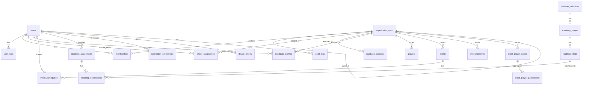

# ER Diagram

```mermaid
erDiagram
  users ||--o{ user_roles : has
  users ||--o{ memberships : has
  users ||--o{ officer_assignments : scoped_admin
  organization_units ||--o{ organization_units : parent_of
  organization_units ||--o{ memberships : contains
  organization_units ||--o{ officer_assignments : scoped_to
  organization_units ||--o{ candidate_requests : assigned_to
  organization_units ||--o{ candidate_profiles : assigned_to
  organization_units ||--o{ prayers : targets
  organization_units ||--o{ events : targets
  organization_units ||--o{ announcements : targets
  organization_units ||--o{ silent_prayer_events : targets
  users ||--o{ candidate_profiles : owns
  users ||--o{ event_participation : intends
  events ||--o{ event_participation : has
  users ||--o{ roadmap_assignments : assigned
  roadmap_definitions ||--o{ roadmap_stages : has
  roadmap_stages ||--o{ roadmap_steps : has
  roadmap_assignments ||--o{ roadmap_submissions : has
  roadmap_steps ||--o{ roadmap_submissions : submitted_for
  silent_prayer_events ||--o{ silent_prayer_participation : aggregates
  users ||--o{ notification_preferences : configures
  users ||--o{ device_tokens : owns
  users ||--o{ audit_logs : actor
```
