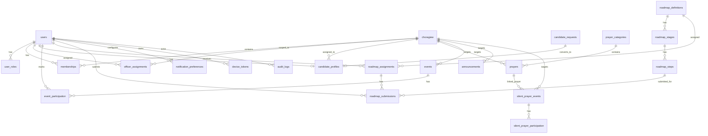

# ER Diagram

```mermaid
erDiagram
  users ||--o{ user_roles : has
  users ||--o{ memberships : has
  choragiew ||--o{ memberships : contains
  users ||--o{ officer_assignments : assigned
  choragiew ||--o{ officer_assignments : scoped_to
  candidate_requests ||--o| candidate_profiles : converts_to
  users ||--o| candidate_profiles : has
  choragiew ||--o{ candidate_profiles : assigned_to
  prayer_categories ||--o{ prayers : contains
  choragiew ||--o{ prayers : targets
  choragiew ||--o{ events : targets
  events ||--o{ event_participation : has
  users ||--o{ event_participation : marks
  choragiew ||--o{ announcements : targets
  roadmap_definitions ||--o{ roadmap_stages : has
  roadmap_stages ||--o{ roadmap_steps : has
  roadmap_definitions ||--o{ roadmap_assignments : assigned
  users ||--o{ roadmap_assignments : receives
  roadmap_assignments ||--o{ roadmap_submissions : has
  roadmap_steps ||--o{ roadmap_submissions : submitted_for
  users ||--o{ roadmap_submissions : submits
  prayers ||--o{ silent_prayer_events : linked_prayer
  choragiew ||--o{ silent_prayer_events : targets
  silent_prayer_events ||--o{ silent_prayer_participation : has
  users ||--o{ notification_preferences : configures
  users ||--o{ device_tokens : owns
  users ||--o{ audit_logs : actor
```

The diagram is intentionally V1-level. Future hierarchy entities must be added only after scope approval.

