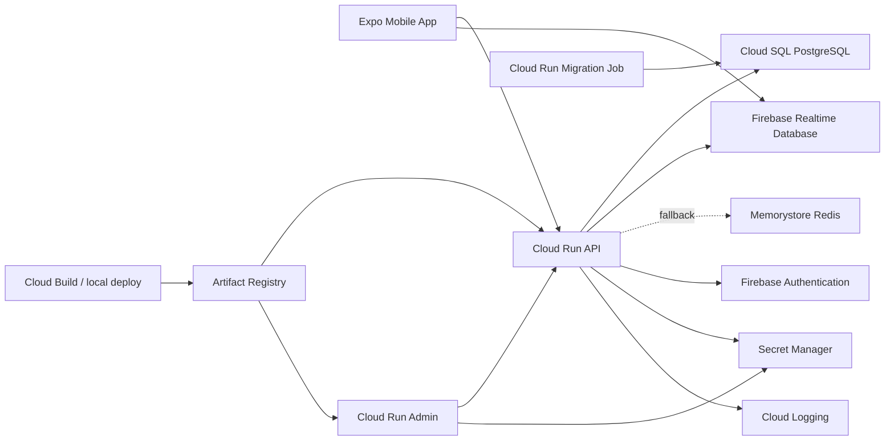

# Google Cloud Launch Plan

This plan turns the current JP2 V1 codebase into a Google Cloud pilot
deployment. It is intentionally step-by-step so the coding agent can own repo
changes and the human owner can own account, billing, DNS, Firebase, and secret
decisions.

## When To Start

Use this plan as a planning artifact during Phase 12. Implement production
deployment artifacts close to the end of V1:

1. Finish or stabilize Phase 12 privacy, retention, export/erasure, content
   approval, Firebase, and runtime requirements.
2. Add local API/Admin Dockerfiles and container smoke checks if they help prove
   production runtime assumptions.
3. Start Terraform and Google Cloud rollout as Phase 13 pilot-readiness work.

This timing avoids building infrastructure around API, secret, realtime
provider, Firebase, or migration assumptions that may still change during
hardening. Before provisioning Memorystore for pilot, implement and validate the
Firebase Realtime Database silent-prayer migration plan so pilot can avoid Redis
idle cost if aggregate-count realtime behavior passes security and device tests.

## Target Architecture

## Roles

| Workstream | Agent owns | Human owner owns |
| --- | --- | --- |
| Repo implementation | Dockerfiles, Terraform modules, scripts, docs, smoke checks | Review and approval |
| Google Cloud access | Exact commands, validation steps, error triage | Billing, project creation, IAM access, command execution when credentials are required |
| Firebase | Config docs, app env wiring, API secret names | Firebase project, Google sign-in, OAuth client IDs, authorized domains |
| Silent-prayer realtime | RTDB provider plan, rules, API/mobile adapter work, tests, rollback docs | Approve cost/security tradeoff and Firebase database creation |
| DNS/domains | Terraform/DNS instructions and validation checks | Domain ownership, DNS provider updates |
| Secrets | Secret names, templates, safe setter scripts | Real secret values |
| Launch approval | Readiness checklist and rollback runbook | Legal/content/privacy approval and final launch decision |

## Deployment Phases

### Phase 0: Readiness Audit

Agent deliverables:

- Confirm all production runtime requirements from code and docs.
- Produce final environment and secret list.
- Confirm whether staging and pilot production are separate projects.
- Confirm migration strategy and rollback assumptions.
- Confirm the selected silent-prayer realtime provider. Default pilot target is
  Firebase RTDB after the migration slice passes; Redis/Memorystore remains the
  fallback provider if owner accepts the idle cost.

Human tasks:

- Choose Google Cloud organization/project.
- Choose region.
- Choose domains.
- Confirm pilot vs production separation.

Exit criteria:

- `docs/deployment/environment-and-secrets.md` is complete for the selected
  environment.
- `docs/deployment/manual-google-tasks.md` has no unknown project/domain
  placeholders for the first pilot environment.

### Phase 1: Containerization

Agent deliverables:

- Add API Dockerfile.
- Add Admin Dockerfile.
- Add repo-level `.dockerignore`.
- Add local container build/run scripts.
- Add container smoke checks for `/api/health` and mounted Admin Lite routes.

Human tasks:

- Run the local build commands.
- Share logs if a local container fails.

Exit criteria:

- API and Admin images build locally.
- Containers run with local env and pass smoke checks.

### Phase 2: Terraform Foundation

Agent deliverables:

- Add Terraform root under `infra/terraform`.
- Provision required APIs, service accounts, Artifact Registry, Secret Manager
  secret shells, Cloud SQL, Memorystore, Cloud Run services, Cloud Run migration
  job, and minimum IAM.
- Add `terraform.tfvars.example`.

Human tasks:

- Authenticate with `gcloud`.
- Run `terraform init`, `terraform plan`, and `terraform apply`.
- Approve or reject plan changes.

Exit criteria:

- Infrastructure exists with placeholder services and secret references.
- No secret values are committed or stored in plaintext Terraform files.

### Phase 3: Secrets And Firebase

Agent deliverables:

- Add scripts or documented commands to set secret versions.
- Wire Cloud Run services to Secret Manager.
- Document Firebase web/mobile config variables.

Human tasks:

- Enable Firebase Authentication Google provider.
- Create web, iOS, and Android app registrations as needed.
- Add authorized domains.
- Set secret values.

Exit criteria:

- API starts in production mode with Firebase provider enabled.
- Admin/API session flow works against staging.
- Mobile Google/Firebase sign-in is validated on at least one native target.

### Phase 4: Build, Push, Migrate, Deploy

Agent deliverables:

- Build and push scripts for API/Admin images.
- Cloud Run service revision deployment commands or CI pipeline.
- Cloud Run migration job execution command.
- Smoke test commands for API, Admin, auth, public content, and silent prayer.

Human tasks:

- Run deployment commands for the first pilot environment.
- Share Cloud Run logs when smoke checks fail.

Exit criteria:

- Latest API and Admin revisions serve traffic.
- Migration job succeeds.
- Smoke checks pass on generated Cloud Run URLs.

### Phase 5: Domains And Cookies

Agent deliverables:

- Custom-domain setup instructions.
- Cookie, CORS, and redirect-domain validation checklist.
- Smoke checks for custom domains.

Human tasks:

- Update DNS.
- Verify domain ownership if required.
- Add Firebase authorized domains.

Exit criteria:

- `api.<domain>` and `admin.<domain>` serve HTTPS.
- Admin session cookies work through the custom domain.
- Firebase redirect/sign-in works on deployed domains.

### Phase 6: Pilot Readiness

Agent deliverables:

- Backup and restore test procedure.
- Support runbook.
- Rollback procedure.
- Final scenario smoke checklist.

Human tasks:

- Run restore test in non-production.
- Approve official content, privacy wording, and pilot seed data.
- Approve pilot launch.

Exit criteria:

- Release gates in `docs/delivery/release-plan.md` are satisfied.
- Phase 13 pilot readiness can move from pending to in progress/complete.

## Suggested First Implementation Commit

1. Add Dockerfiles and `.dockerignore`.
2. Add `infra/terraform` skeleton with variables but no live resources.
3. Add deployment scripts for local image build only.
4. Run local container smoke checks.

This keeps the first deployment commit low risk and avoids touching Google
Cloud until the build artifacts are proven locally.
