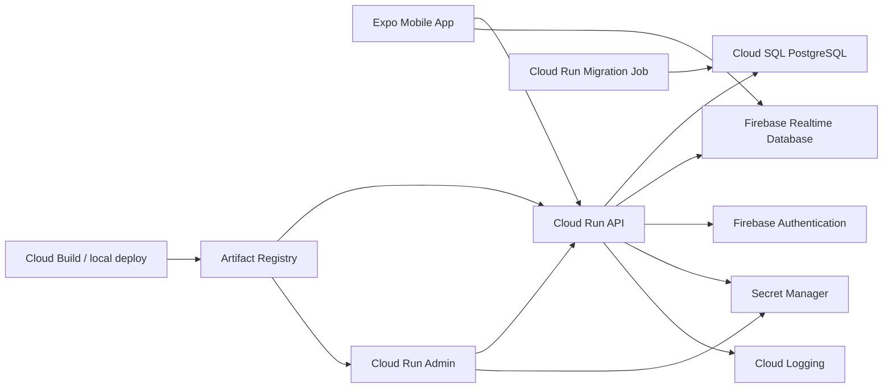

# Google Cloud Launch Plan

This plan turns the current JP2 V1 codebase into a Google Cloud pilot
deployment. It is intentionally step-by-step so the coding agent can own repo
changes and the human owner can own account, billing, DNS, Firebase, and secret
decisions.

## When To Start

Use this plan as a planning artifact during Phase 12. Implement production
deployment artifacts close to the end of V1:

1. Finish or stabilize Phase 12 privacy, retention, export/erasure, content
   approval, Firebase, and runtime requirements.
2. Add local API/Admin Dockerfiles and container smoke checks if they help prove
   production runtime assumptions.
3. Keep Cloud Run/Cloud SQL assumptions lean: no live Redis/Memorystore,
   shallow `/api/health` readiness, Prisma pool limits, production boot retry,
   and migrations through a standalone Cloud Run Job.
4. Start Terraform and Google Cloud rollout as Phase 13 pilot-readiness work.

This timing avoids building infrastructure around API, secret, realtime
provider, Firebase, or migration assumptions that may still change during
hardening. Owner direction on June 3, 2026: live pilot infrastructure must not
provision Redis/Memorystore. Implement and validate the Firebase Realtime
Database silent-prayer migration plan before launch so aggregate-count realtime
behavior uses RTDB with API-owned authorization.

## Target Architecture

## Roles

| Workstream | Agent owns | Human owner owns |
| --- | --- | --- |
| Repo implementation | Dockerfiles, Terraform modules, scripts, docs, smoke checks | Review and approval |
| Google Cloud access | Exact commands, validation steps, error triage | Billing, project creation, IAM access, command execution when credentials are required |
| Firebase | Config docs, app env wiring, API secret names | Firebase project, Google sign-in, OAuth client IDs, authorized domains |
| Silent-prayer realtime | RTDB provider plan, rules, API/mobile adapter work, tests, rollback docs | Approve Firebase database creation |
| DNS/domains | Terraform/DNS instructions and validation checks | Domain ownership, DNS provider updates |
| Secrets | Secret names, templates, safe setter scripts | Real secret values |
| Launch approval | Readiness checklist and rollback runbook | Legal/content/privacy approval and final launch decision |

## Deployment Phases

### Phase 0: Readiness Audit

Agent deliverables:

- Confirm all production runtime requirements from code and docs.
- Produce final environment and secret list.
- Confirm whether staging and pilot production are separate projects.
- Confirm migration strategy and rollback assumptions.
- Confirm Firebase RTDB is configured as the only live silent-prayer realtime
  provider. Redis/Memorystore is not part of pilot or production infrastructure
  unless a future owner-approved scope change reverses this decision.

Human tasks:

- Choose Google Cloud organization/project.
- Choose region.
- Choose domains.
- Confirm pilot vs production separation.

Exit criteria:

- `docs/deployment/environment-and-secrets.md` is complete for the selected
  environment.
- `docs/deployment/manual-google-tasks.md` has no unknown project/domain
  placeholders for the first pilot environment.

### Phase 1: Containerization

Current repo baseline:

- API Dockerfile: `infra/docker/api.Dockerfile`
- Admin Dockerfile: `infra/docker/admin.Dockerfile`
- root Docker ignore rules: `.dockerignore`
- local profile-gated compose smoke: `infra/docker/docker-compose.yml`
- smoke commands and local notes: `infra/docker/README.md`

Agent deliverables:

- Maintain the API Dockerfile.
- Maintain the Admin Dockerfile.
- Maintain repo-level `.dockerignore`.
- Maintain local container build/run documentation.
- Validate container smoke checks for `/api/health` and mounted Admin Lite routes.
- Preserve the existing shallow `/api/health` readiness contract; database and
  provider checks belong in deployment smoke checks or one-off jobs, not the
  Cloud Run readiness endpoint.

Human tasks:

- Run the local build commands.
- Share logs if a local container fails.

Exit criteria:

- API and Admin images build locally.
- Containers run with local env and pass smoke checks.

### Phase 2: Terraform Foundation

Current repo baseline:

- Terraform root: `infra/terraform`
- implemented first milestone: API enablement, service accounts, Artifact
  Registry, Secret Manager secret shells, placeholder API/Admin Cloud Run
  services, outputs, and `terraform.tfvars.example`
- implemented second milestone: Cloud SQL PostgreSQL instance/database, Cloud
  SQL client IAM, Cloud Run Prisma migration job, reduced migration pool
  settings, and Cloud SQL/migration outputs
- implemented third milestone: Firebase project/RTDB Terraform resources,
  owner-created Firebase import commands, generated RTDB URL output, API
  `FIREBASE_DATABASE_URL` wiring from Terraform, and explicit Firebase CLI rules
  deployment guidance
- implemented fourth milestone: dry-run-first Cloud Run build/push/migrate/deploy
  helper, backup/restore runbook, and launch smoke checklist
- implemented fifth milestone: custom-domain/DNS runbook and dry-run-first
  validation helper
- implemented sixth milestone: auth cookie, CORS, and redirect-domain checklist
- implemented seventh milestone: support/rollback runbook
- implemented eighth milestone: pilot launch approval evidence template
- implemented ninth milestone: Secret Manager version and rotation runbook
- implemented tenth milestone: Cloud SQL runtime verification checklist
- implemented eleventh milestone: deployment operator handoff sequence
- intentionally pending: owner DNS changes, custom-domain live validation, and
  live apply

Agent deliverables:

- Maintain Terraform root under `infra/terraform`.
- Provision required APIs, service accounts, Artifact Registry, Secret Manager
  secret shells, Cloud SQL, Firebase RTDB, Cloud Run services, Cloud Run
  migration job, and minimum IAM across milestone slices.
- Maintain `terraform.tfvars.example`.
- Set API Prisma runtime variables for low-cost Cloud SQL use:
  `PRISMA_CONNECT_ON_BOOT=true`, low `PRISMA_CONNECTION_LIMIT`, bounded
  `PRISMA_POOL_TIMEOUT_SECONDS`, and startup retry values.
- Run Prisma migrations from the Cloud Run migration job before new service
  revisions take traffic; do not run migrations inside API/Admin request
  containers.

Human tasks:

- Authenticate with `gcloud`.
- Run `terraform init`, `terraform plan`, and `terraform apply`.
- Approve or reject plan changes.

Exit criteria:

- Infrastructure exists with placeholder services and secret references.
- No secret values are committed or stored in plaintext Terraform files.

### Phase 3: Secrets And Firebase

Agent deliverables:

- Secret-version setup and rotation runbook:
  [secret-version-runbook.md](secret-version-runbook.md).
- Wire Cloud Run services to Secret Manager.
- Document Firebase web/mobile config variables.

Human tasks:

- Enable Firebase Authentication Google provider.
- Create web, iOS, and Android app registrations as needed.
- Add authorized domains.
- Set secret values.

Exit criteria:

- API starts in production mode with Firebase provider enabled.
- Admin/API session flow works against staging.
- Mobile Google/Firebase sign-in is validated on at least one native target.

### Phase 4: Build, Push, Migrate, Deploy

Agent deliverables:

- Maintain the dry-run-first Cloud Run deploy helper:
  `tools/deploy/cloud-run-deploy.mjs`.
- Build and push API/Admin images through `pnpm deploy:cloud-run build --execute`
  and `pnpm deploy:cloud-run push --execute`.
- Run the Cloud Run migration job through
  `pnpm deploy:cloud-run migrate --execute`.
- Update API/Admin Cloud Run revisions through
  `pnpm deploy:cloud-run deploy --execute`.
- Run deployed HTTP smoke checks through `pnpm deploy:cloud-run smoke`.
- Cloud SQL connection/pool smoke checks:
  [cloud-sql-runtime-checklist.md](cloud-sql-runtime-checklist.md).
- Deployment operator handoff sequence:
  [deployment-operator-handoff.md](deployment-operator-handoff.md).

Human tasks:

- Run deployment commands for the first pilot environment.
- Share Cloud Run logs when smoke checks fail.

Exit criteria:

- Latest API and Admin revisions serve traffic.
- Migration job succeeds.
- Smoke checks pass on generated Cloud Run URLs.

### Phase 5: Domains And Cookies

Agent deliverables:

- Custom-domain setup instructions:
  [domain-and-dns-runbook.md](domain-and-dns-runbook.md).
- Cookie, CORS, and redirect-domain validation checklist:
  [auth-cookie-cors-checklist.md](auth-cookie-cors-checklist.md).
- Smoke checks for custom domains through `pnpm deploy:domains check --execute`.

Human tasks:

- Update DNS.
- Verify domain ownership if required.
- Add Firebase authorized domains.

Exit criteria:

- `api.<domain>` and `admin.<domain>` serve HTTPS.
- Admin session cookies work through the custom domain.
- Firebase redirect/sign-in works on deployed domains.

### Phase 6: Pilot Readiness

Agent deliverables:

- Backup and restore test procedure:
  [backup-restore-runbook.md](backup-restore-runbook.md).
- Support runbook:
  [support-and-rollback-runbook.md](support-and-rollback-runbook.md).
- Rollback procedure:
  [support-and-rollback-runbook.md](support-and-rollback-runbook.md#rollback-procedure).
- Final scenario smoke checklist:
  [launch-smoke-checklist.md](launch-smoke-checklist.md).
- Pilot launch approval record:
  [pilot-launch-approval-record.md](pilot-launch-approval-record.md).
- Ordered deployment operator handoff:
  [deployment-operator-handoff.md](deployment-operator-handoff.md).

Human tasks:

- Run restore test in non-production.
- Approve official content, privacy wording, and pilot seed data.
- Fill the pilot launch approval record in the launch ticket or release notes
  without committing owner-specific values.
- Approve pilot launch.

Exit criteria:

- Release gates in `docs/delivery/release-plan.md` are satisfied.
- Phase 13 pilot readiness can move from pending to in progress/complete.

## Suggested First Implementation Commit

1. Add Dockerfiles and `.dockerignore`.
2. Add `infra/terraform` skeleton with variables but no live resources.
3. Add deployment scripts for local image build only.
4. Run local container smoke checks.

This keeps the first deployment commit low risk and avoids touching Google
Cloud until the build artifacts are proven locally.
