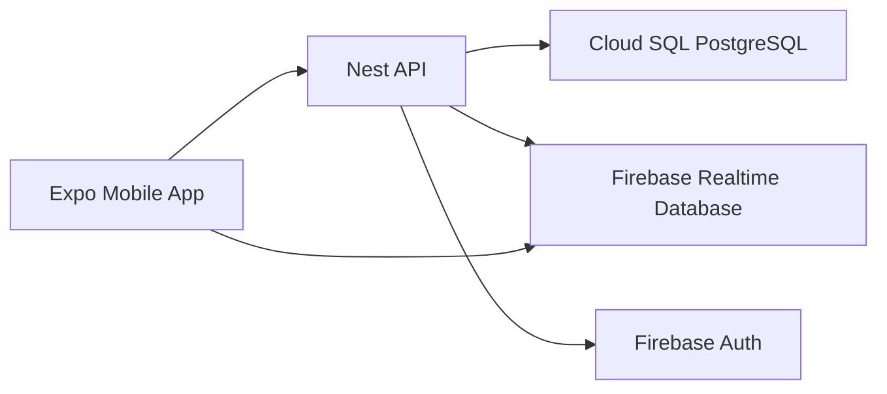

# Firebase Realtime Database Silent-Prayer Migration Plan

## Purpose

This plan documents the next live deployment slice for silent-prayer realtime
presence. The current implementation uses Redis TTL presence keys and a
Socket.IO Redis adapter, but owner direction on June 3, 2026 excludes
Redis/Memorystore from live pilot and production infrastructure. The target live
path is Firebase Realtime Database (RTDB) for aggregate-only live count updates
while preserving the API as the authorization boundary.

## Decision

Move silent-prayer realtime presence from the current Redis/Socket.IO
implementation to a Firebase RTDB-backed provider before the Google Cloud pilot.
Redis/Memorystore must not be provisioned for pilot or production unless a future
owner-approved scope change reverses this decision.

The migration must not change these V1 privacy and scope rules:

- no chat, comments, audio, video, rankings, maps, analytics, or social feed;
- no participant lists, rosters, user ids, anonymous session ids, or prayer
  history in realtime payloads;
- public guests can see only public/family-open aggregate counts;
- brothers can see only aggregate counts for sessions authorized by the API;
- all event visibility, active-window checks, and brother organization-unit
  scope checks stay server-side in the Nest API.

## Current Production Baseline

Implemented Redis responsibilities:

1. `SilentPrayerPresenceStore` stores one short-lived key per active participant.
2. Redis TTL expires stale connections after missed heartbeats.
3. Redis prefix counting returns aggregate active counts.
4. Socket.IO broadcasts aggregate count updates to joined rooms.
5. The Socket.IO Redis adapter keeps broadcasts correct across multiple API
   instances.
6. `REDIS_URL` is required in production today; local/test can use the
   deterministic in-memory store.

## Target Pilot Architecture

PostgreSQL remains the source of truth for silent-prayer events. The API remains
the only service that authorizes joins and writes realtime state. RTDB becomes a
small read-side realtime store for aggregate counters and short-lived read
grants.



Target RTDB paths:

```text
silentPrayerPublicCounts/{eventId}
  activeCount
  updatedAt

silentPrayerPrivateCounts/{eventId}
  activeCount
  updatedAt

silentPrayerPresence/{eventId}/{participantKey}
  expiresAt
  participantType
  updatedAt

silentPrayerReadGrants/{firebaseUid}/{eventId}
  expiresAt
```

Rules:

- `silentPrayerPublicCounts/{eventId}` can be readable by anyone because it
  contains only aggregate counts for API-approved public/family-open events.
- `silentPrayerPrivateCounts/{eventId}` is readable only when
  `auth.uid` has an unexpired `silentPrayerReadGrants/{uid}/{eventId}` entry.
- `silentPrayerPresence` is not readable by mobile clients.
- mobile clients never write presence, grants, or counts.
- all writes are performed by the API through Firebase Admin credentials.

This shape avoids trying to encode Postgres-backed event visibility, active
membership, organization-unit assignments, and officer scope in RTDB Security
Rules.

## Implementation Steps

### Step 1: Add Provider Configuration

Add a typed runtime configuration value such as:

```text
SILENT_PRAYER_REALTIME_PROVIDER=redis-socket | firebase-rtdb | in-memory
```

Rules:

- `in-memory` is allowed only outside production.
- `redis-socket` documents the current implemented Redis behavior, but must not
  be used for live pilot or production after the June 3, 2026 no-Redis owner
  decision.
- `firebase-rtdb` is the live pilot and production target.
- production startup must fail if the selected provider is missing required
  environment values.
- no screen, controller, or service should read `process.env` directly; provider
  selection belongs in a small config/factory module.

Required Firebase values:

```text
FIREBASE_PROJECT_ID
FIREBASE_DATABASE_URL
jp2-firebase-service-account-json
```

### Step 2: Keep Domain Logic Provider-Neutral

Do not move visibility or role checks into the RTDB adapter. Keep the flow:

1. API receives list/join/heartbeat/leave request.
2. `SilentPrayerService` validates event status, publish state, active window,
   visibility, active brother membership, and organization-unit scope.
3. `SilentPrayerPresenceService` delegates storage and count publication through
   a provider-neutral port.
4. Provider adapter writes Redis or RTDB as selected.

Recommended boundary:

```text
SilentPrayerPresenceStore
  upsertPresence(key, ttlMs, now)
  deletePresence(key)
  countPresence(prefix, now)

SilentPrayerRealtimePublisher
  publishPublicCount(eventId, count, now)
  publishPrivateCount(eventId, count, now)
  grantPrivateRead(firebaseUid, eventId, ttlMs, now)
  revokePrivateRead(firebaseUid, eventId)
```

The Redis adapter can keep count broadcasting through Socket.IO. The RTDB adapter
publishes aggregate counts to RTDB. Shared service code should not know which
provider is active.

### Step 3: Add REST Heartbeat And Leave Contracts

Current heartbeat and leave behavior is Socket.IO-only. RTDB needs API-owned
heartbeat and leave endpoints so the server can keep authorization and presence
writes under its control.

Add public endpoints:

```text
POST /api/public/silent-prayer-events/{id}/heartbeat
POST /api/public/silent-prayer-events/{id}/leave
```

Add brother endpoints:

```text
POST /api/brother/silent-prayer-events/{id}/heartbeat
POST /api/brother/silent-prayer-events/{id}/leave
```

Contract rules:

- public heartbeat/leave accepts the anonymous session id already used by join;
- brother heartbeat/leave uses the existing bearer/cookie principal;
- route/body event ids must match when body contains an event id;
- responses return aggregate count and expiry only;
- responses never return participant keys, Firebase uid, anonymous session id,
  user id, grant path, RTDB path, or participant lists.

### Step 4: Implement RTDB Adapter

Create an adapter in the API silent-prayer module rather than placing Firebase
Admin calls in services or controllers.

Adapter responsibilities:

- derive privacy-preserving participant keys:
  - public: hash event id + anonymous session id with an application secret;
  - brother: hash event id + local user id or Firebase uid with an application
    secret;
- upsert presence records with `expiresAt` and `updatedAt`;
- delete presence records on leave;
- count only non-expired records;
- publish aggregate counts to the correct public/private count path;
- write private read grants for authenticated users when they join authorized
  brother sessions;
- remove or let expire grants on leave;
- never store prayer text, intention text, participant display names, email
  addresses, local user ids, Firebase uid in presence records, or request IP
  addresses.

Because RTDB has no Redis-style automatic TTL deletion, add cleanup behavior:

- count operations ignore expired records;
- heartbeat/list/join/leave paths opportunistically remove expired records for
  the event being touched;
- add a scheduled cleanup job only if pilot usage shows stale records growing.

Status: initial API provider implementation complete. The API now selects
`firebase-rtdb` through `SILENT_PRAYER_REALTIME_PROVIDER`, uses a Firebase Admin
RTDB-backed presence store, derives hashed participant keys with
`SILENT_PRAYER_PRESENCE_HASH_SECRET`, ignores/removes expired presence rows
during counts, publishes public/private aggregate count paths after server-side
authorization, and issues/revokes private read grants using active Firebase
provider subjects. Firebase emulator/rules tests and native-device validation
remain pending.

### Step 5: Replace Mobile Socket.IO With A Realtime Client Port

Do not call Firebase SDK directly from React Native screens. Add a mobile port:

```text
SilentPrayerRealtimeClient
  subscribePublicCount(eventId, onCount)
  subscribePrivateCount(eventId, firebaseUser, onCount)
  close()
```

Implementations:

- current Socket.IO client for non-live `redis-socket` compatibility only;
- Firebase RTDB listener for `firebase-rtdb`;
- fake deterministic listener for tests/demo.

Mobile flow for RTDB:

1. load sessions through the existing REST list endpoint;
2. call existing REST join endpoint;
3. subscribe to the returned authorized count channel type;
4. send REST heartbeat on the configured interval;
5. send REST leave when exiting the route;
6. unsubscribe listener on route exit/logout/role switch;
7. clear private listeners immediately when auth state changes.

The mobile model must continue to expose only aggregate count and user-facing
status.

Status: initial implementation complete. Mobile now has a provider-neutral
`SilentPrayerRealtime` port, keeps Socket.IO as the default compatibility
provider, supports `firebase-rtdb` aggregate-count listeners through
`EXPO_PUBLIC_SILENT_PRAYER_REALTIME_PROVIDER=firebase-rtdb`, sends heartbeat and
leave through the REST contracts, and subscribes only to one public/private
aggregate count path while the silent-prayer screen is active.

### Step 6: Add RTDB Security Rules

Create committed rules documentation and, when Firebase tooling is introduced,
commit a deployable rules file.

Rules must deny by default:

```json
{
  "rules": {
    ".read": false,
    ".write": false
  }
}
```

Then open only the aggregate read paths:

- public count path: read-only aggregate data;
- private count path: read only when `auth.uid` has an unexpired grant;
- all presence/grant paths: no client read or write unless explicitly needed for
  private count rule evaluation.

Status: baseline rules file committed at
[`infra/firebase/database.rules.json`](../../infra/firebase/database.rules.json).
Rules are deny-by-default, allow public aggregate reads, gate private aggregate
reads through unexpired grants, and deny client presence/grant reads and writes.
Firebase emulator/rules tests are wired through `pnpm test:firebase-rules` with
committed `firebase.json`, `@firebase/rules-unit-testing`, and Firebase CLI
tooling.

Validation checklist:

- anonymous guest cannot read private count paths;
- authenticated candidate/brother without grant cannot read private count paths;
- authenticated brother with grant can read only the granted event count;
- no mobile client can write presence, count, or grant data;
- denied reads do not leak metadata beyond Firebase's normal permission error.

### Step 7: Tests And Quality Gates

Add failing tests before implementation where possible:

- provider config rejects `in-memory` in production;
- provider config rejects `firebase-rtdb` without `FIREBASE_DATABASE_URL`;
- public RTDB adapter writes only aggregate count and hashed participant key;
- brother RTDB adapter writes private read grant and aggregate count only;
- expired presence is ignored in counts;
- leave deletes/revokes the expected records;
- REST heartbeat/leave responses omit participant identity;
- guest cannot access brother heartbeat/leave endpoints;
- brother session scope still delegates to `SilentPrayerService`;
- mobile RTDB listener updates aggregate count and unsubscribes on route exit;
- mobile auth change closes private count listeners;
- RTDB rules deny unauthorized private count reads and all client writes.
- Firebase emulator rules tests verify public aggregate reads, unexpired
  API-issued private read grants, expired/ungranted denial paths, and denied
  client writes to count, presence, and grant paths.

Required gates before merging:

```bash
pnpm exec nx run-many -t lint,typecheck -p api,mobile
pnpm exec nx test api
pnpm exec nx test mobile
pnpm test:coverage
pnpm contract:generate
pnpm contract:check
pnpm db:migrate:check
```

Run Firebase rules/emulator tests before enabling the live RTDB provider:

```bash
pnpm test:firebase-rules
```

The command starts the Firebase Realtime Database Emulator and requires Java. On
this macOS workspace it uses the Android Studio bundled JBR when `JAVA_HOME` is
not set.

### Step 8: Deployment Rollout

Use a feature-flagged rollout:

1. deploy RTDB rules first;
2. add `FIREBASE_DATABASE_URL` and Admin SDK secret access;
3. deploy API with `SILENT_PRAYER_REALTIME_PROVIDER=firebase-rtdb`;
4. deploy mobile build that supports the RTDB provider;
5. verify public and brother silent-prayer joins on a device;
6. verify aggregate-only RTDB data in Firebase console;
7. verify live Terraform has no Memorystore/Redis resources or secrets.

Rollback:

- switch to single-instance `in-memory` only for non-production or an
  owner-approved emergency pilot mitigation;
- never loosen RTDB rules to restore functionality.

## Cost Controls

Target RTDB usage should stay small:

- store only counters and short-lived presence/grant records;
- do not store event metadata, descriptions, prayer content, user display names,
  emails, rosters, or audit payloads in RTDB;
- subscribe only while the silent-prayer screen is active;
- unsubscribe on route exit, logout, role change, and app background if needed;
- keep listener paths narrow to one event count, never whole event collections;
- set Firebase budget alerts before pilot at low thresholds.

Expected pilot cost is `$0-$5/month` for normal low-volume use because Firebase
Realtime Database includes a no-cost tier for small storage and download volume.

## Completion Criteria

The migration is complete only when:

- Redis/Memorystore is no longer required for pilot production startup when
  `SILENT_PRAYER_REALTIME_PROVIDER=firebase-rtdb`;
- all silent-prayer REST authorization rules remain server-side;
- mobile displays live aggregate counts through RTDB;
- no participant/session/user identity is visible in API responses, RTDB read
  paths, mobile state, logs, or audit summaries;
- RTDB rules are deny-by-default and tested;
- traceability, implementation status, deployment, environment/secrets, and
  technical-decision docs are updated in the same commit as code changes;
- quality gates and coverage pass.
