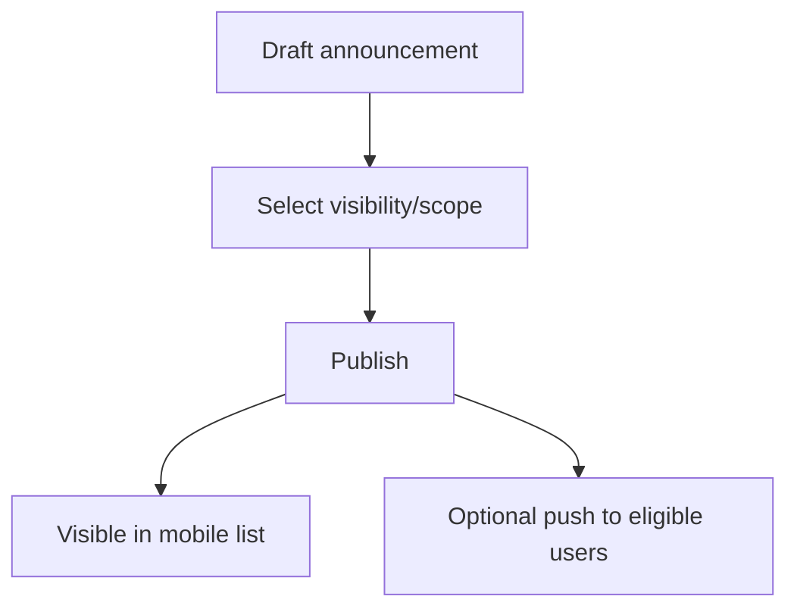

# Announcement Flow

## Covers

16. Officer publishes announcement.

| Item | Detail |
| --- | --- |
| Actor | Officer, Super Admin, Candidate/Brother |
| Trigger | Admin needs to publish audience-scoped message |
| Preconditions | Admin has permission and target audience selected |
| Happy path | Admin drafts announcement, selects visibility/scope, publishes; users in audience see it; optional push sent by preferences |
| Alternative paths | Draft saved; archived; pinned; edited before publish |
| Failure cases | Missing visibility, officer targets unrelated chorągiew, push provider failure |
| Permissions | Officer scoped; super admin all |
| Data created/updated | `announcements`, audit for publish/visibility, notification jobs |
| Acceptance criteria | Announcement is one-way; no private audience receives wrong message |

