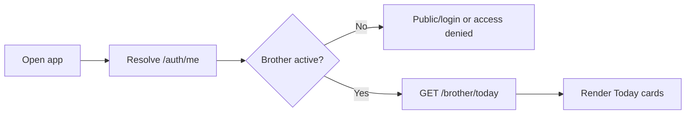

# Brother Daily Use Flow

## Covers

8. Brother opens Today dashboard.

| Item | Detail |
| --- | --- |
| Actor | Brother |
| Trigger | Brother opens app while authenticated |
| Preconditions | Active brother role and membership |
| Happy path | App resolves brother mode; loads Today; shows degree, next step, prayer, event, announcement, active silent prayer |
| Alternative paths | No upcoming event; no announcement; no roadmap assignment |
| Failure cases | Expired session, inactive user, missing membership |
| Permissions | Brother self and own chorągiew only |
| Data created/updated | Optional last seen/session metadata only |
| Acceptance criteria | Brother understands what matters today; dashboard does not expose unrelated data |

