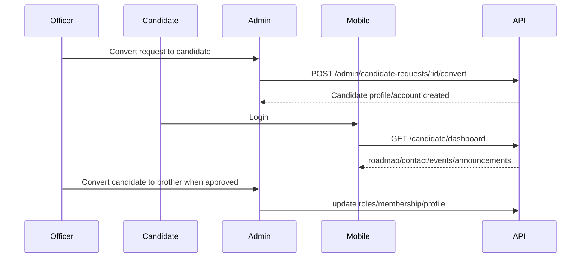

# Candidate Onboarding Flow

## Covers

6. Candidate logs in and follows candidate roadmap.
7. Candidate is converted to brother.

| Item | Detail |
| --- | --- |
| Actor | Candidate, Officer, Super Admin |
| Trigger | Officer decides request should become authenticated candidate |
| Preconditions | Candidate request exists; invitation/account process chosen |
| Happy path | Officer creates candidate; candidate logs in; follows roadmap; officer later creates brother membership |
| Alternative paths | Candidate paused; candidate rejected; candidate assigned to another chorągiew by super admin |
| Failure cases | Duplicate user email, missing chorągiew assignment, inactive candidate |
| Permissions | Candidate self-read; officer own scope; super admin all |
| Data created/updated | `users`, `user_roles`, `candidate_profiles`, `roadmap_assignments`, later `memberships` |
| Acceptance criteria | Candidate cannot see brother content; conversion is administrative and audited |

