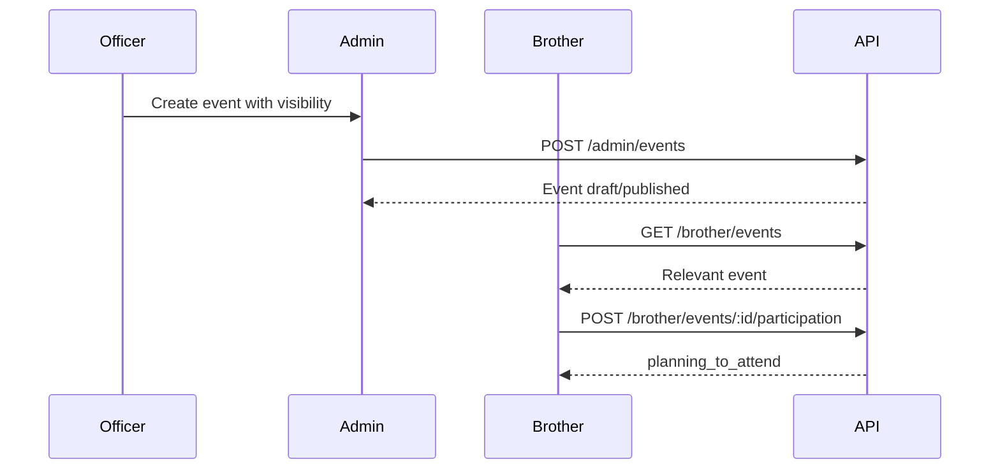

# Event Participation Flow

## Covers

9. Brother joins event.
14. Officer creates public event.
15. Officer creates brother-only event.

| Item | Detail |
| --- | --- |
| Actor | Brother, Candidate, Officer |
| Trigger | Officer publishes event; user opens visible event |
| Preconditions | Event has valid time, status, visibility, and scope |
| Happy path | Officer creates event with explicit visibility; user sees it; user marks planning to attend; officer sees aggregate/intents for scoped event |
| Alternative paths | User cancels intent; event cancelled; event archived after completion |
| Failure cases | User cannot see event; duplicate intent; officer tries unrelated scope |
| Permissions | Public visibility for guests; candidate/brother/scoped rules for authenticated users |
| Data created/updated | `events`, `event_participation`, audit for publish/cancel |
| Acceptance criteria | Participation is intent only; private events are never public |

