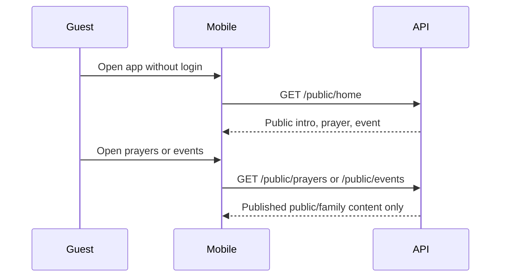

# Guest Discovery Flow

## Covers

1. Guest opens app and discovers Order.
2. Guest reads public prayers.
3. Guest views public/family event.

## Flow

| Item | Detail |
| --- | --- |
| Actor | Guest, wife/family member, interested person |
| Trigger | Fresh app open or public link |
| Preconditions | Public APIs available; public content may be empty |
| Happy path | Guest opens app, reads intro, opens public prayer, opens public/family event, sees join/login CTAs |
| Alternative paths | No public events; no public prayers; language content missing |
| Failure cases | API unavailable, private id requested, content archived |
| Permissions | No authentication; `PUBLIC` and `FAMILY_OPEN` only |
| Data created/updated | None |
| Acceptance criteria | App does not require login; private content is never returned; empty states are respectful |

