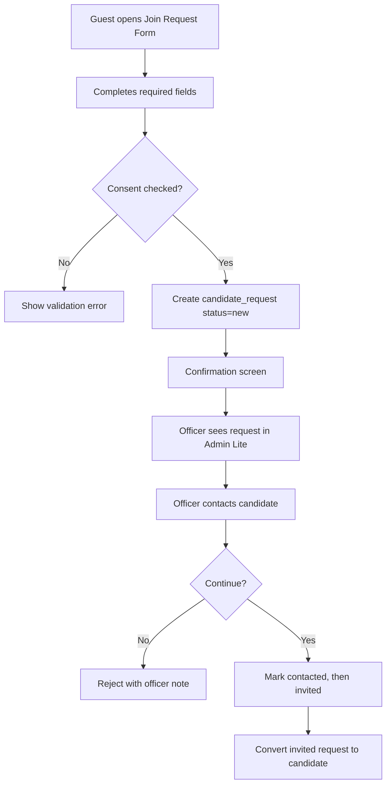

# Join Request Flow

## Covers

4. Guest submits join request.
5. Officer processes candidate request.

| Item | Detail |
| --- | --- |
| Actor | Guest, Officer |
| Trigger | Guest taps "I want to join" |
| Preconditions | Consent wording approved; candidate request endpoint available |
| Happy path | Guest submits form; request stored with consent; officer reviews, contacts, marks contacted, marks invited, then converts to candidate |
| Alternative paths | Duplicate email flagged; request assigned later; officer rejects with note |
| Failure cases | Missing required fields, consent missing, invalid email, officer lacks scope |
| Permissions | Public create; officer scoped read/update; super admin all |
| Data created/updated | `candidate_requests`, audit for admin status changes |
| Acceptance criteria | Request is traceable; guest is not automatically made candidate or brother; conversion is allowed only after invitation |

## V1 Follow-Up Expectations

- Candidate request status transitions are intentionally small: `new -> contacted/rejected`, `contacted -> invited/rejected`, and `invited -> rejected` or conversion through the dedicated convert action.
- Rejection requires an officer note so the decision is auditable and understandable to the admin team.
- `rejected` and `converted_to_candidate` are terminal request states.
- The V1 pilot expectation is human follow-up within 7 calendar days of request creation and a status update after each meaningful contact attempt. The app records status and officer notes but does not send automated reminders until a later approved workflow.
