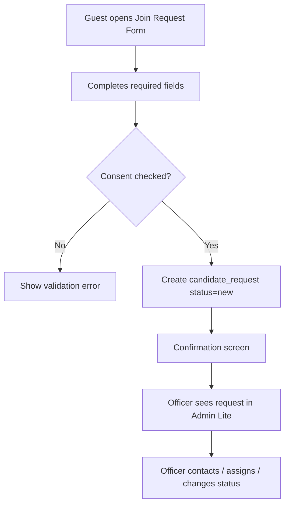

# Join Request Flow

## Covers

4. Guest submits join request.
5. Officer processes candidate request.

| Item | Detail |
| --- | --- |
| Actor | Guest, Officer |
| Trigger | Guest taps "I want to join" |
| Preconditions | Consent wording approved; candidate request endpoint available |
| Happy path | Guest submits form; request stored with consent; officer reviews and updates status |
| Alternative paths | Duplicate email flagged; request assigned later; officer rejects with note |
| Failure cases | Missing required fields, consent missing, invalid email, officer lacks scope |
| Permissions | Public create; officer scoped read/update; super admin all |
| Data created/updated | `candidate_requests`, audit for admin status changes |
| Acceptance criteria | Request is traceable; guest is not automatically made candidate or brother |

