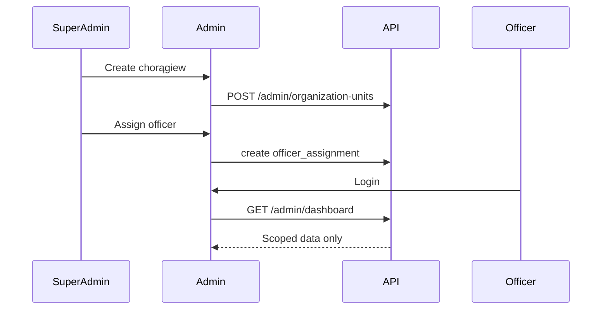

# Officer Management Flow

## Covers

17. Super Admin creates chorągiew and assigns officer.

| Item                 | Detail                                                                                                                  |
| -------------------- | ----------------------------------------------------------------------------------------------------------------------- |
| Actor                | Super Admin                                                                                                             |
| Trigger              | New pilot/local chorągiew needs administration                                                                          |
| Preconditions        | Super admin logged into Admin Lite                                                                                      |
| Happy path           | Super admin creates chorągiew; creates/selects officer user; assigns officer; officer logs in and sees scoped dashboard |
| Alternative paths    | Archive chorągiew; end officer assignment; assign replacement                                                           |
| Failure cases        | Duplicate chorągiew, inactive officer user, officer tries unrelated data                                                |
| Permissions          | Super admin write; officer read/write own scope after assignment                                                        |
| Data created/updated | `organization_units`, `users`, `user_roles`, `officer_assignments`, audit logs                                          |
| Acceptance criteria  | Officer scope works immediately; critical assignment changes audited                                                    |

