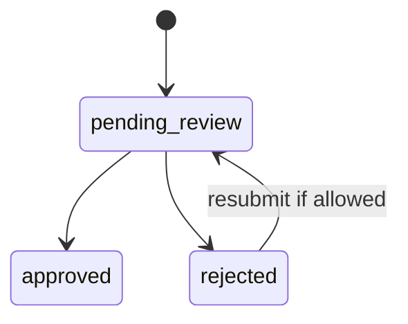

# Roadmap Submission Flow

## Covers

10. Brother submits roadmap step.
11. Officer approves/rejects roadmap step.

| Item | Detail |
| --- | --- |
| Actor | Brother, Officer |
| Trigger | Brother completes a formation step requiring review |
| Preconditions | Roadmap assignment exists; step accepts submission |
| Happy path | Brother submits step; status becomes pending; officer reviews; approves or rejects with comment; brother sees result |
| Alternative paths | Officer requests more information via rejection/comment; brother resubmits if allowed |
| Failure cases | Duplicate pending submission; officer out of scope; roadmap archived |
| Permissions | Brother own roadmap; officer scoped to brother chorągiew; super admin all |
| Data created/updated | `roadmap_submissions`, audit log, optional notification |
| Acceptance criteria | App does not auto-award degrees; rejection requires comment; decision audited |

