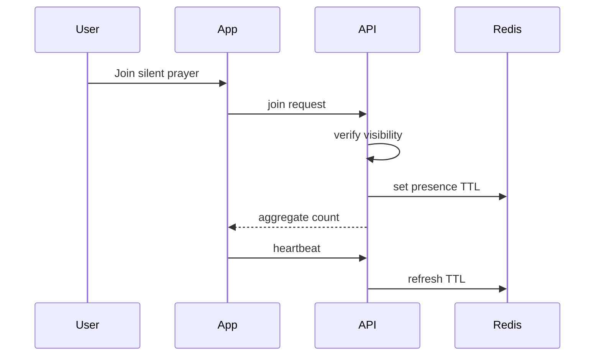

# Silent Prayer Flow

## Covers

12. Brother joins silent prayer.
13. Guest joins public silent prayer anonymously.

| Item | Detail |
| --- | --- |
| Actor | Guest, Brother, Officer |
| Trigger | Prayer session is active |
| Preconditions | Silent prayer event published and visible to actor |
| Happy path | User opens session, joins, counter increments, heartbeat maintains presence, user leaves or disconnects |
| Alternative paths | Public anonymous join; authenticated brother join; reconnect before TTL expires |
| Failure cases | Session closed, user lacks visibility, socket disconnected, duplicate join |
| Permissions | Public sessions for guests; brother sessions for brothers/own scope |
| Data created/updated | Redis presence; optional aggregate `silent_prayer_participation` |
| Acceptance criteria | Aggregate counter only; no participant list; duplicates prevented |

