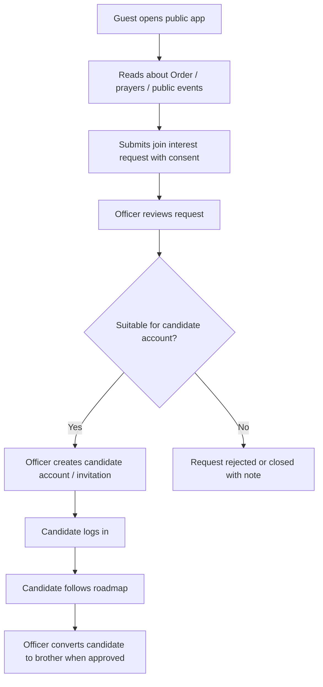
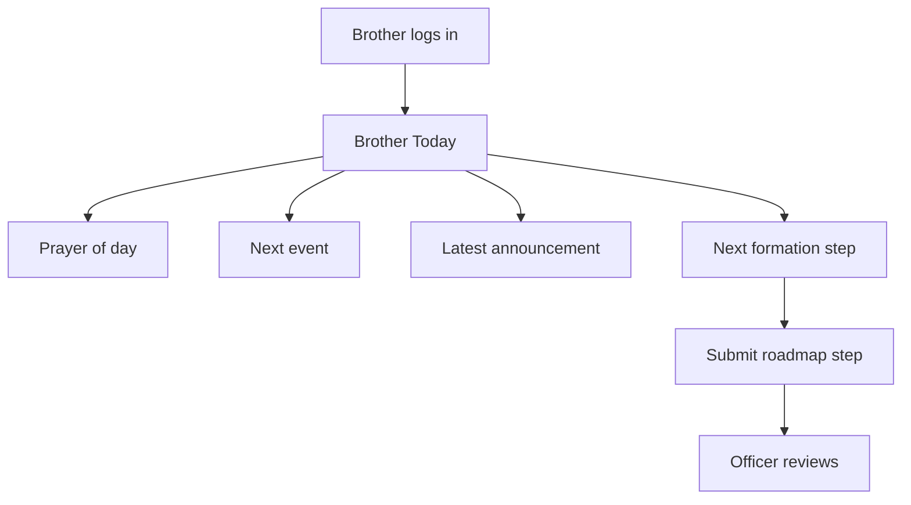
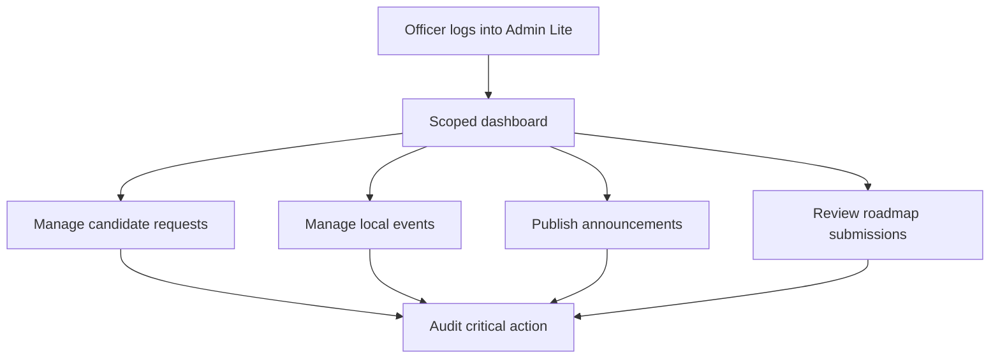

# User Flows Overview

## Candidate Funnel

```mermaid
flowchart TD
  A["Guest opens public app"] --> B["Reads about Order / prayers / public events"]
  B --> C["Submits join interest request with consent"]
  C --> D["Officer reviews request"]
  D --> E{"Suitable for candidate account?"}
  E -->|Yes| F["Officer creates candidate account / invitation"]
  E -->|No| G["Request rejected or closed with note"]
  F --> H["Candidate logs in"]
  H --> I["Candidate follows roadmap"]
  I --> J["Officer converts candidate to brother when approved"]
```

## Brother Daily Use

```mermaid
flowchart TD
  A["Brother logs in"] --> B["Brother Today"]
  B --> C["Prayer of day"]
  B --> D["Next event"]
  B --> E["Latest announcement"]
  B --> F["Next formation step"]
  F --> G["Submit roadmap step"]
  G --> H["Officer reviews"]
```

## Admin Lite Operations

```mermaid
flowchart TD
  A["Officer logs into Admin Lite"] --> B["Scoped dashboard"]
  B --> C["Manage candidate requests"]
  B --> D["Manage local events"]
  B --> E["Publish announcements"]
  B --> F["Review roadmap submissions"]
  C --> G["Audit critical action"]
  D --> G
  E --> G
  F --> G
```

Detailed flow documents live in `/docs/flows`.

